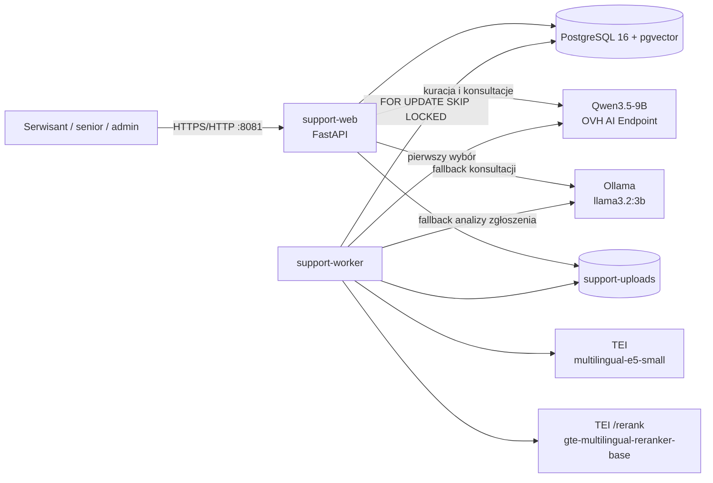
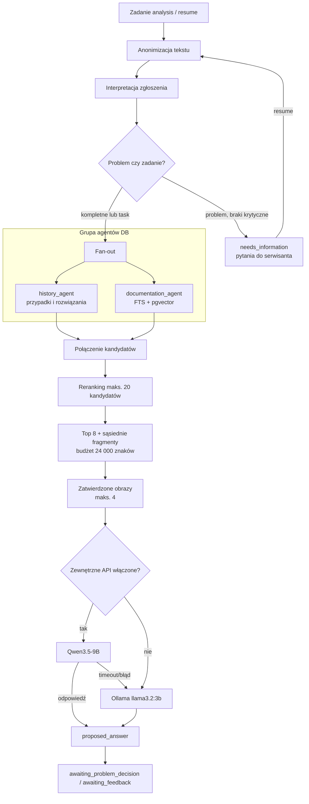
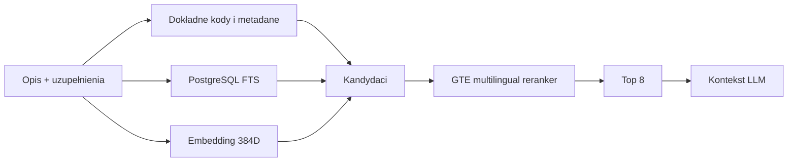
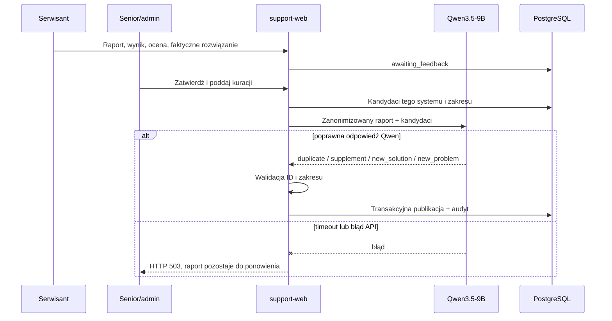

# Projekt techniczny panelu asystenta serwisowego

Stan dokumentu: 2026-07-24, wdrożenie pilotażowe `support-web:8081`.

## 1. Cel i granice

Panel wspiera serwisantów systemów ZZL i ASW. Przyjmuje zgłoszenia, wyszukuje
zatwierdzone przypadki oraz dokumentację techniczną, przygotowuje podpowiedź,
zbiera raport realizacji i poddaje go kuracji wiedzy. V1 jest systemem doradczym:
nie łączy się z instalacjami klientów i nie wykonuje na nich poleceń.

Izolacja wiedzy jest realizowana na dwóch wymiarach:

- każde wyszukiwanie jest ograniczone do jednego `program_id`;
- wiedza prywatna ma `client_id`, a wiedza globalna jest dostępna wszystkim
  klientom danego systemu.

## 2. Topologia

`support-web` odpowiada za uwierzytelnianie, RBAC, CSRF, formularze i audytowane
decyzje człowieka. `support-worker` wykonuje długie analizy poza procesem HTTP.
Kolejka oraz stan biznesowy są w PostgreSQL, dzięki czemu restart kontenera nie
usuwa zgłoszeń.

Kuracja raportu nadal jest wywołaniem synchronicznym `support-web`. Wymaga
zewnętrznego Qwen i nie przechodzi na lokalną Ollamę. Timeout API wynosi 300 s;
błąd pozostawia raport do ponowienia.

## 3. Graf analizy zgłoszenia

LangGraph jest deterministycznym `StateGraph`. Nie jest swobodnym agentem
wykonującym narzędzia.

### Stan i trwałość

- `ticket_id` jest `thread_id` LangGraph;
- checkpointy LangGraph są zapisywane przez `PostgresSaver` z szyfrowanym
  serializerem;
- `support.workflow_checkpoints` przechowuje kompatybilny podgląd ostatniego
  stanu;
- `support.support_jobs` realizuje kolejkę z blokadą
  `FOR UPDATE SKIP LOCKED`;
- typowe stany zadania: `queued`, `running`, `done`, `failed_retryable`,
  `cancelled`.

Administrator może logicznie anulować analizę. Worker sprawdza stan zadania przed
zapisem i odrzuca spóźnioną odpowiedź. Trwające wywołanie HTTP modelu może
wykorzystywać zasoby do własnego timeoutu, ale jego wynik nie zmieni zgłoszenia.

## 4. Retrieval i ranking

`history_agent` przeszukuje zatwierdzone przypadki historyczne i rozwiązania.
`documentation_agent` przeszukuje chunki instrukcji przez FTS i podobieństwo
wektorowe. Oba agenty otrzymują ten sam system i zasady widoczności klienta.

Instrukcje są dzielone strukturalnie według nagłówków, procedur, kroków i
akapitów. Podział bazowy używa celu 1600 znaków i overlapa 220 znaków, ale nie
przenosi overlapa pomiędzy różnymi procedurami. Model może zaproponować logiczne
grupy, które senior zatwierdza przed utworzeniem embeddingów 384D.

## 5. Raport realizacji i kuracja wiedzy

Kurator może:

- `duplicate` — tylko zaktualizować skuteczność istniejącej metody;
- `supplement` — zaktualizować skuteczność i dopisać nowy krok;
- `new_solution` — dodać inną metodę dla istniejącego problemu;
- `new_problem` — utworzyć odrębny problem i rozwiązanie.

Starszy serwisant oraz administrator mogą ponowić kurację wyniku utworzonego
wcześniej przez lokalny fallback. System wycofuje wyłącznie osobne artefakty
tamtego przebiegu (`new_solution`/`new_problem`) i ponownie wysyła raport do
Qwen. Istniejąca wiedza nie jest usuwana.

## 6. Obrazy

Obrazy zgłoszeń i przypadków są przechowywane poza bazą w
`/data/support-uploads`; PostgreSQL przechowuje metadane i powiązania. Do
zewnętrznego modelu trafiają wyłącznie obrazy typu `problem`, których
anonimizację administrator jawnie zatwierdził. Analiza wybiera maksymalnie
cztery obrazy: najpierw bieżącego zgłoszenia, później dopasowanych przypadków.
Obrazy rozwiązania są wiązane z publikowaną metodą i pokazywane przy kolejnych
trafieniach.

## 7. Bezpieczeństwo i niezawodność

- hasła: Argon2id;
- sesje: serwerowe, cookie HttpOnly;
- operacje modyfikujące: token CSRF;
- role: `technician`, `senior_technician`, `admin`;
- tekst przed zewnętrznym API: anonimizacja identyfikatorów, PESEL, danych
  kontaktowych, IP i poświadczeń;
- klient jest reprezentowany pseudonimem, nie nazwą;
- każde uruchomienie, anulowanie, feedback i publikacja zapisują audyt;
- klucze API znajdują się wyłącznie w nieśledzonym `.env`;
- backup obejmuje jednocześnie PostgreSQL i `support-uploads`.

## 8. Wersje wdrożenia

### Runtime i modele

| Element | Wersja/model | Identyfikacja wdrożenia |
|---|---|---|
| Python | 3.12.13 | obraz aplikacji |
| PostgreSQL | 16.14 | `pgvector/pgvector:pg16` |
| Migracje | `0013_historical_case_images` | Alembic head |
| Ollama | 0.31.1 | `ollama/ollama:latest` |
| Lokalny LLM | `llama3.2:3b`, ID `a80c4f17acd5` | ok. 2,0 GB |
| Zewnętrzny LLM | `Qwen3.5-9B` | OVH AI Endpoint, Chat Completions |
| Embedding | `intfloat/multilingual-e5-small` | 384 wymiary, TEI CPU |
| Reranker | `Alibaba-NLP/gte-multilingual-reranker-base` | TEI CPU `/rerank` |

Obrazy z tagiem `latest` są zmienne. Digesty działające w dniu aktualizacji:

- TEI i reranker:
  `sha256:019d3b897c9f74eaef2ae89046ea1c234fe6ec0e22270a52fdcebdd446ae4f05`;
- Ollama:
  `sha256:9b7fc10e6cc5384ba56dcded723666a2f157b40f808ff26050838b5bb28b995e`;
- PostgreSQL/pgvector:
  `sha256:fcc9ab623261c9076c2d6016b28d602ceb45ddb641845836efb5d945eaede554`.

### Najważniejsze biblioteki aplikacji

| Biblioteka | Wersja |
|---|---:|
| FastAPI | 0.115.6 |
| Uvicorn | 0.34.0 |
| LangGraph | 0.2.74 |
| langgraph-checkpoint-postgres | 2.0.15 |
| psycopg | 3.2.3 |
| Alembic | 1.14.1 |
| Pydantic Settings | 2.7.1 |
| Requests | 2.32.3 |
| Argon2-cffi | 23.1.0 |
| Cryptography | 44.0.0 |
| Pillow | 11.1.0 |
| pypdf | 5.1.0 |
| python-docx | 1.1.2 |
| pytest | 8.3.4 |

Źródłem prawdy dla pakietów jest `app/requirements.txt`, a dla usług
`docker-compose.yml`. Zalecane jest zastąpienie tagów `latest` wersjami lub
digestami przed środowiskiem produkcyjnym.

## 9. Znane ograniczenia

- kuracja działa synchronicznie w `support-web`; docelowo powinna trafić do
  trwałej kolejki;
- anulowanie analizy nie przerywa fizycznie już wysłanego żądania HTTP;
- obrazy są anonimizowane organizacyjnie przez administratora, bez lokalnego
  OCR i automatycznego maskowania;
- tagi `latest` utrudniają identyczne odtworzenie środowiska;
- przed pilotem wymagany jest zestaw co najmniej 30 przypadków i test braku
  wycieku danych pomiędzy klientami.

